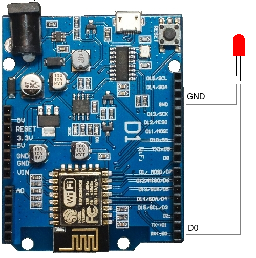

# crypto-notification-esp8266

It is application for ESP8266 D1 R1 WiFi board, that inform users about high BTC price changes.
In case when BTC price change about 1% in 2 minutes, a red led turn on for next 10 minutes.

### Instruction:
- Connect the red led with DO and GND inputs.
  
  
- Set up wifi ssid and password in "wifi.c" file.

### More information:
- [ESP8266 D1 R1 WiFi board shop](https://protosupplies.com/product/esp8266-di-wifi-with-uno-footprint/)
- [Api documentation](https://docs.cloud.coinbase.com/sign-in-with-coinbase/docs/api-exchange-rates)
- [Board scheme 1](docs/ESP8266-D1-R1-Pinout-2.jpg)
- [Board scheme 2](docs/Wemos-D1-Pin-Differences.jpg)
- [Datasheet](docs/esp8266ex_datasheet_en.pdf)
